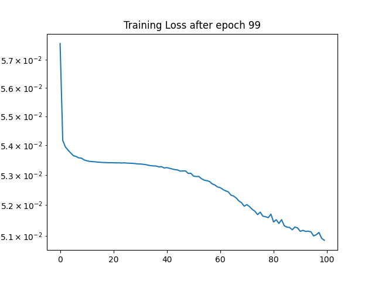

# dhp19_sdnn_min_example
Minimal example to train and export a SDNN based on DHP19 data

# Sample data
Download the sample data at https://drive.switch.ch/index.php/s/9aICDpDuVmoH4Bs and store it in the `data` folder.

## Data format

### Inputs / Event frames
A single input is an event frame of 260x344 pixels. Each scene was recored from 4 cameras. We present 8 consecutive event frames to the SDNN. With a batch size of 8, the input shape is thus `[8, 1, 260, 344, 4, 8]`: 8 batches, 1 channel, 260x344 pixels, 4 cameras, 8 time steps.

During training (yet) we chose a single camera to train on. Thus, the input to the model is `[8, 1, 260, 344, 8]`: 8 batches, 1 channel, 260x344 pixels, 8 time steps.
```
input.shape()   # torch.Size([8, 1, 260, 344, 4, 8])
```

### Targets / Labels
The target for each joint is a single frame of 260x344 pixels. We have labels for 13 joints. We present 8 consecutive event frames to the SDNN. With a batch size of 8, the target shape is thus `[8, 13, 260, 344, 4, 8]`: 8 batches, 13 channels/joints, 260x344 pixels, 4 cameras, 8 time steps.

During training (yet) we chose a single camera to train on. Thus, the target for the model is `[8, 13, 260, 344, 8]`: 8 batches, 13 channels/joints, 260x344 pixels, 8 time steps.

```
target.shape # torch.Size([8, 13, 260, 344, 4, 8])
```


# Requirements
The code was tested with Python 3.8.10 and the following packages:
- lava_nc-0.7.0.tar.gz
- lava_dl-0.3.3.tar.gz
- torch 1.13.1+cu117

Running in the nvidia/cuda:11.6.2-devel-ubuntu20.04 docker container.

# Model
The proposed CNN [1] has 17 convolutional layers. Each layer has 3x3 filter size and is followed by Rectified Linear Unit (ReLU) activation. The DVS resolution is used as the CNN input resolution, and it is decreased with two max pooling layers in the first stages of the network. Then, it is recovered in later stages with two transposed convolution layers with stride 2. The convolutional layers of the network do not include biases. This architectural choice was motivated by an increase in the activation sparsity at a negligible decrease in performance. As discussed in Sec. 6, activation sparsity could be exploited for faster processing. The CNN has about 220k parameters and requires 6.2 GOp/frame, where one Op is one multiplication or addition. In designing the CNN, we paid attention both to its prediction accuracy and computational complexity, to minimize model size for real-time applications.

CNN architecture details. Changes in spatial resolution (Res.) are due to 2x2 max pooling (MP) or transposed convolution (TC) with stride 2. Dilation refers to the dilation rate in convolutional layers. The input is a constant-count DVS frame with shape 344x260x1.
| Layer     | 1   | 2   | 3   | 4  | 5  | 6  | 7  | 8  | 9   | 10  | 11  | 12  | 13  | 14  | 15  | 16  | 17  |
|-----------|-----|-----|-----|----|----|----|----|----|-----|-----|-----|-----|-----|-----|-----|-----|-----|
| Stride    | 1   | 1   | 1   | 1  | 1  | 1  | 1  | 1  | 2   | 1   | 1   | 1   | 1   | 2   | 1   | 1   | 1   |
| Dilation  | 1   | 1   | 1   | 1  | 2  | 2  | 2  | 2  | 1   | 2   | 2   | 2   | 2   | 1   | 1   | 1   | 1   |
| Res.      | MP  |     |     | MP |    |    |    |    | TC  |     |     |     |     | TC  |     |     |     |
| Output ch | 16  | 32  | 32  | 32 | 64 | 64 | 64 | 64 | 32  | 32  | 32  | 32  | 32  | 16  | 16  | 16  | 13  |
| Output H  | 130 | 130 | 130 | 65 | 65 | 65 | 65 | 65 | 130 | 130 | 130 | 130 | 130 | 260 | 260 | 260 | 260 |
| Output W  | 172 | 172 | 172 | 86 | 86 | 86 | 86 | 86 | 172 | 172 | 172 | 172 | 172 | 344 | 344 | 344 | 344 |

The CNN model predicts a set of 2D heatmaps, representing the probability of the joint presence at each pixel location, as proposed in [2].

[1] Calabrese, E., Taverni, G., Easthope, C. A., Skriabine, S., Corradi, F., Longinotti, L., Eng, K., & Delbruck, T. (n.d.). DHP19: Dynamic Vision Sensor 3D Human Pose Dataset. https://sites.google.com/view/dhp19.

[2] Jonathan J. Tompson, Arjun Jain, Yann LeCun, and Christoph Bregler. Joint training of a convolutional network and a graphical model for human pose estimation. In Advances in Neural Information Processing Systems (NIPS), pages 1799–1807, 2014
https://github.com/max-andr/joint-cnn-mrf

We tried to implement the model as described in the paper as SDNN using lava-dl. However, we are not sure if we got it right. The model is implemented in `dhp19_sdnn_model.py`.

# Training
The model is trained using the `dhp19_sdnn_train.py` script. It will traine the SDNN version of the Model described above. The training script stores model Input/Output samples every 5 epochs in `results/train/experiment_name/plots`.
The model is exported  as hdf5 network to `results/train/experiment_name/trained_model.net` after training. It is/should be supported by `lava.lib.dl.netx` to automatically load the network as a lava process.


## Training progress




# Run inference using lava

See the SDNN Example in the lava-dl tutorial https://github.com/lava-nc/lava-dl/blob/main/tutorials/lava/lib/dl/netx/pilotnet_sdnn/run.ipynb to get started.

